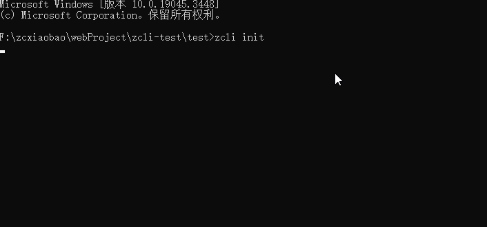
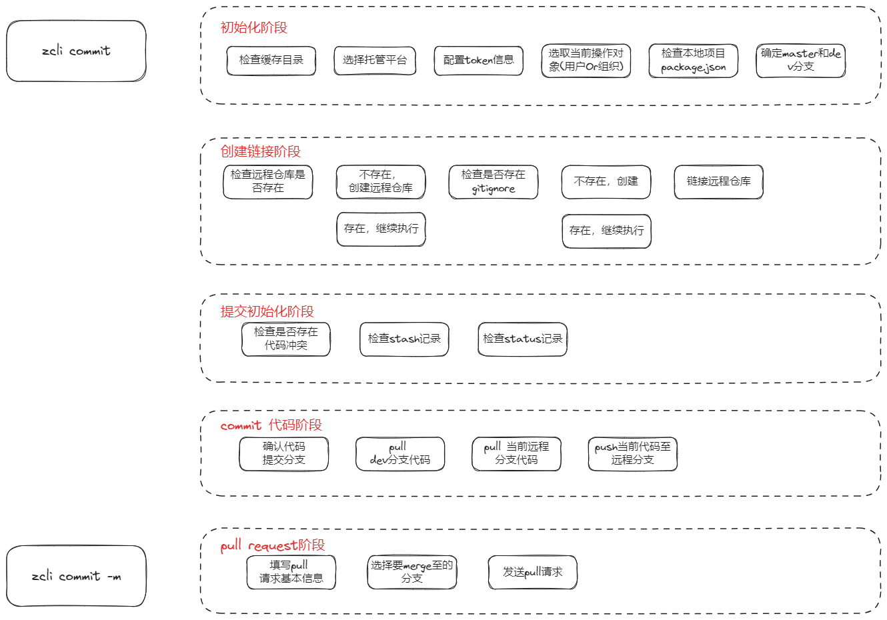
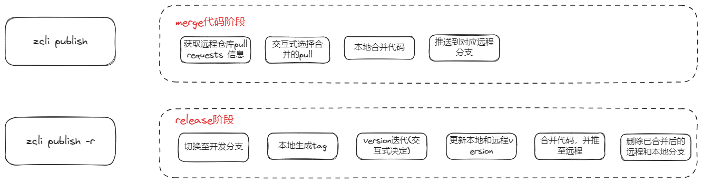
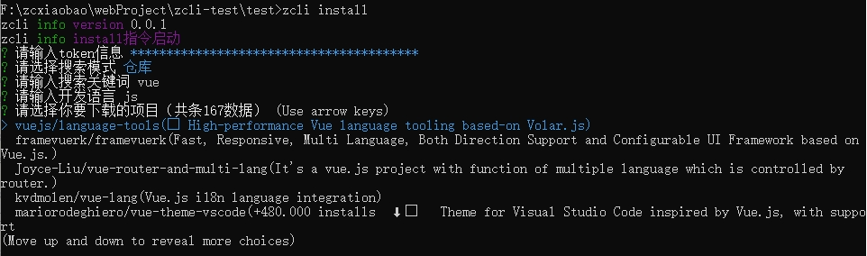
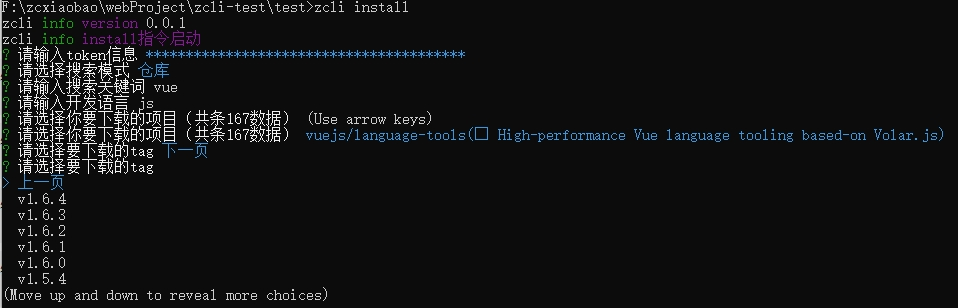

## zcli 简介

> 版本: 目前还处于第一阶段测试中

志在打造全流程脚手架，解放"繁琐"的过程，降本提效。

开发进度——[github 仓库](https://github.com/zcxiaobao/zcli)

- [x] 项目创建——init 指令
- [x] Git 仓库下载器——install 指令
- [x] 自动化代码提交——commit 指令
- [x] 自动化代码合并——publish 指令
- [ ] 代码规范检查——lint 指令
- [ ] 自动化云发布部署——deploy 指令
- [ ] 其他指令

## 安装下载

```js
npm install @zcxiaobao-cli/cli -g
```

下载完毕后，命令行使用 `zcli` 即可。


### 配置项

1. `-V` zcli 版本信息
2. `-d` 开启 debug 模式，更准确、更全面的过程提示及错误提示
3. `-h` help 指令

## 项目创建 init 指令

```js
// 具体使用
zcli init
```



init 指令目前仅支持**项目**创建，组件还在后续开发中。

### 优点

1. zcli 脚手架自带多套标准模板，可供大家使用，同时支持模板的缓存及更新功能。
2. zcli 项目信息交互式配置，支持 ejs 动态渲染。
3. init 指令还提供模板依赖安装及项目自启动功能，几句指令，轻松搭建项目开发。

### 后续开发设想

1. 将模板信息存储在后端中，支持模板的增删查改，增加模板使用的自由度。
2. 扩展 init 指令配置项，可实现本地项目直接转化为模板功能。
3. 。。。

## commit 指令

```js
// 具体使用
zcli commit [-m]
```

提供 `-m` 配置项，使用该配置项，可以在本地发起 `pull requests` 请求。

commit 指令运行依据 gitflow 机制，可实现多人协作，具体流程可分为 5 个阶段，见下图。



commit 指令几乎复刻了开发中的代码提交工作，可以实现代码提交的全流程自动化。目前仅支持 github 托管平台，gitee 后续开发中。

## publish 指令

```js
// 具体使用
zcli publish [-r]
```

提供 `-r` 配置项，打包 tag，迭代 version。

publish 指令前三个阶段与 commit 指令相同，仅在后两个阶段有区别。



## install 指令

代码下载器指令

```js
// 具体使用
zcli install
```

1. 支持源码、仓库两种查询方式
2. 获取仓库信息后，提供上下翻页功能
3. 支持获取仓库的各 tag 版本，同样支持翻页功能
4. 选定仓库后，下载仓库
5. 对于 npm 格式仓库，目前还支持依赖安装及自启动




