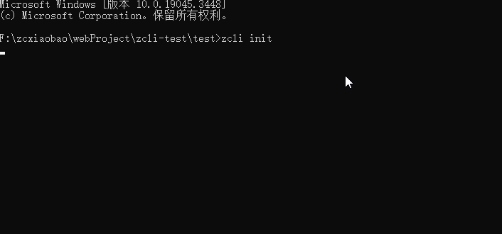

## 项目创建 init 指令

```js
// 具体使用
zcli init
```



init 指令目前仅支持**项目**创建，组件还在后续开发中。

### 优点

1. zcli 脚手架自带多套标准模板，可供大家使用，同时支持模板的缓存及更新功能。
2. zcli 项目信息交互式配置，支持 ejs 动态渲染。
3. init 指令还提供模板依赖安装及项目自启动功能，几句指令，轻松搭建项目开发。

### 后续开发设想

1. 将模板信息存储在后端中，支持模板的增删查改，增加模板使用的自由度。
2. 扩展 init 指令配置项，可实现本地项目直接转化为模板功能。
3. 。。。

更详细的请参考 [zcli](https://www.npmjs.com/package/@zcxiaobao-cli/cli)
